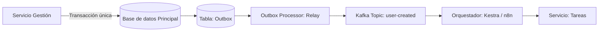
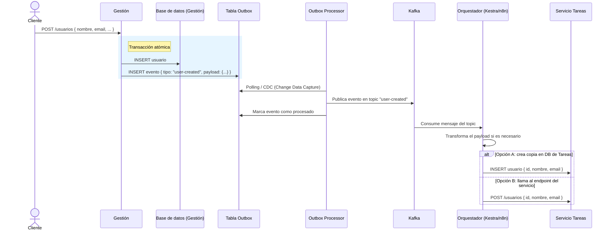
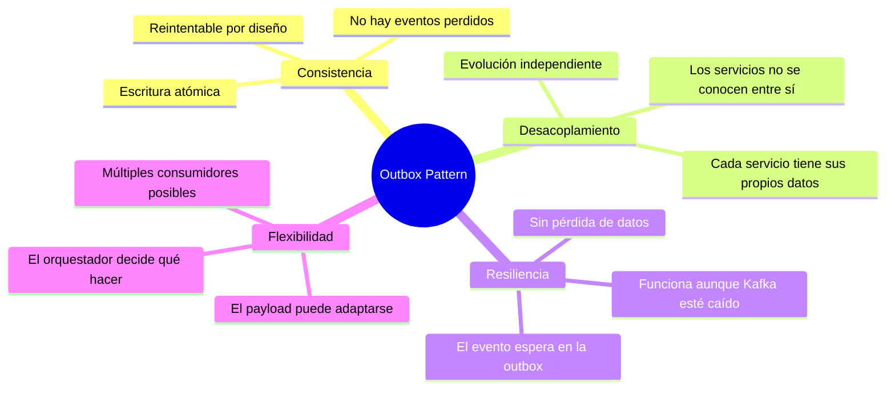

En el proyecto en el que trabajo actualmente utilizamos con frecuencia el **Outbox Pattern**. Este artículo
pretende ser una explicación clara y un recordatorio de los detalles más importantes de este patrón, escrito
desde la experiencia práctica del día a día.

## El problema: microservicios que comparten información

Desarrollamos microservicios, y con frecuencia nos encontramos en la situación de que varios de ellos necesitan
trabajar con la misma información. Si cada microservicio consultara directamente la misma base de datos,
estaríamos generando problemas serios: concurrencia, carga innecesaria, acoplamiento fuerte entre servicios
y, sobre todo, falta de resiliencia.

¿Qué pasa si la operación principal se completa pero el envío del evento a los demás servicios falla?
Sin ningún mecanismo de garantía, acabamos con datos inconsistentes entre servicios: el servicio A cree
que el usuario existe, el servicio B ni siquiera se ha enterado de que fue creado.

Este es exactamente el tipo de problema que resuelve el **patrón Outbox**.

---

## ¿Qué es el patrón Outbox?

El patrón Outbox es una técnica de diseño que garantiza que **una operación de escritura en base de datos
y el envío de un evento asociado ocurran de forma atómica**, es decir, o suceden los dos o no sucede ninguno.

La clave está en una tabla (o colección, en el caso de bases de datos no relacionales) llamada `outbox`.
En lugar de enviar un evento directamente a un broker de mensajería como Kafka, **primero lo escribimos
en la tabla outbox dentro de la misma transacción** que la operación principal. Un proceso separado
(el *outbox processor* o *relay*) se encarga después de leer esa tabla y publicar los eventos al broker.

De esta forma, si algo falla después de la transacción, el evento sigue estando en la tabla outbox y puede
reintentarse sin perder información.

> La clave del patrón es que la escritura en la tabla principal y en la outbox ocurren **en la misma
> transacción**. Esto es lo que garantiza la consistencia.

---

## Un caso práctico: crear un usuario

Imaginemos que tenemos dos microservicios:

- **Gestión**: responsable de los datos completos del usuario (nombre, email, contraseña, roles, etc.).
- **Tareas**: solo necesita saber del usuario su `id`, su `nombre` y su `email` para asignarle tareas.

Si el servicio de Tareas consultara directamente la base de datos de Gestión cada vez que necesita
información del usuario, estaríamos acoplando los dos servicios y generando carga innecesaria.
La solución es que el servicio de Tareas tenga su propia copia, reducida y adaptada, de los datos del usuario.

Así funciona el flujo completo:

### Paso a paso

**1. El cliente crea un usuario en el servicio Gestión.**
El servicio recibe la petición y abre una transacción en base de datos.

**2. Dentro de la misma transacción, escribe dos cosas:**
- El usuario nuevo en la tabla principal de usuarios.
- Un registro en la tabla `outbox` con el tipo de evento (`user-created`) y el payload relevante
  (los datos del usuario que queremos propagar).

**3. La transacción se confirma (commit).**
En este punto tenemos garantía de que ambas escrituras han ocurrido. Si algo falla antes del commit,
ninguna de las dos persiste. No hay estado inconsistente posible.

**4. El Outbox Processor (Relay) entra en acción.**
Este es un proceso independiente que monitoriza la tabla `outbox`. Puede funcionar de dos maneras:

- **Polling**: consulta la tabla periódicamente buscando registros no procesados.
- **Change Data Capture (CDC)**: escucha el log de transacciones de la base de datos
  (por ejemplo, con [Debezium](https://debezium.io/)) para reaccionar a los cambios en tiempo real.

**5. El Relay publica el evento en Kafka.**
Envía el mensaje al topic correspondiente (`user-created`) y, una vez confirmada la publicación,
marca el registro en la tabla `outbox` como procesado.

**6. El orquestador consume el evento.**
Un orquestador como [Kestra](https://kestra.io/) o [n8n](https://n8n.io/) está suscrito al topic de Kafka.
Lee el mensaje, lo transforma si hace falta, y actúa en consecuencia: puede crear directamente un registro
en la base de datos del servicio de Tareas, o llamar a un endpoint de ese servicio.

---

## ¿Cómo es la tabla Outbox?

La estructura típica de una tabla `outbox` en una base de datos relacional sería algo así:

| Campo | Tipo | Descripción |
|---|---|---|
| `id` | UUID | Identificador único del evento |
| `aggregate_type` | VARCHAR | Tipo de entidad afectada (`User`, `Order`...) |
| `aggregate_id` | UUID | ID de la entidad afectada |
| `event_type` | VARCHAR | Tipo de evento (`user-created`, `user-updated`...) |
| `payload` | JSON | Datos del evento (la copia que necesitan otros servicios) |
| `created_at` | TIMESTAMP | Cuándo se creó el registro |
| `processed_at` | TIMESTAMP | Cuándo fue procesado (null si aún no lo ha sido) |

El `payload` puede ser una copia exacta de la entidad o una versión reducida y adaptada,
dependiendo de lo que necesiten los servicios consumidores.

---

## Ventajas del patrón

---

## Resumen

El patrón Outbox resuelve uno de los problemas más comunes en arquitecturas de microservicios:
**cómo garantizar que una operación de negocio y la notificación a otros servicios ocurran de forma consistente**.

La idea central es sencilla: en lugar de confiar en que el envío del evento al broker no fallará,
lo persistimos junto con la operación principal en la misma transacción. A partir de ahí,
un proceso dedicado se encarga de la entrega con todas las garantías.

En nuestro caso, la combinación de **Kafka + un orquestador como Kestra o n8n** nos da además
la flexibilidad de transformar los datos en tránsito y decidir exactamente qué hace cada servicio
consumidor con la información que recibe.

Es un patrón que, una vez que lo entiendes, no puedes dejar de verlo en todas partes.
